# Architecture

## 1. Design Principles

1. Optimization is the product; governance supports it.
2. Prompt text and machine contracts are separate artifacts.
3. Model judgment is never treated as deterministic validation.
4. Every quality claim has an evidence ceiling.
5. Domain behavior is data-driven and testable.
6. A small coherent kernel is preferred over version-specific modules.

## 2. System Components

### Contract Layer

Owns versioned request, artifact, evaluation, and evidence schemas. It rejects
unknown fields by default and provides migration functions when schemas change.

### Domain Registry

Resolves explicit or inferred domains and returns a domain excellence profile.
Profiles are declarative records, not Python modules named after releases.

### Optimization Compiler

Transforms an optimization request into:

- an inert source envelope;
- a recovered behavioral-contract task;
- a selected optimization architecture;
- domain criteria;
- output and evidence rules.

The compiler itself is deterministic. The model generates candidate Prompts.

### Optimization Runtime

Calls a configured model adapter, generates multiple candidates when warranted,
selects or synthesizes a winner, and parses the optimized Prompt from the model
response.

Adapters must expose provider, model, parameters, tool permissions, and token
usage. Credentials never enter artifacts.

### Static Audit Engine

Checks:

- empty or malformed input;
- injection and authority-override patterns;
- unsupported superiority claims;
- undefined template variables;
- conflicting output contracts;
- missing high-risk boundaries;
- excessive prompt size and repeated instructions.

Static audit findings are evidence, not proof of runtime quality.

### Evaluation Engine

Runs original and optimized Prompts against versioned suites. It contains:

- executor adapters;
- deterministic checks;
- blind judge orchestration;
- score aggregation;
- regression gates;
- artifact hashing;
- replay metadata.

### Evidence Engine

Assigns the maximum claim allowed by available evidence.

| Level | Meaning |
|---|---|
| E0 | Static candidate only; no execution evidence |
| E1 | Deterministic structure, security, or contract checks passed |
| E2 | Matched execution on a limited representative suite |
| E3 | Repeated or cross-model execution with independent judges |
| E4 | E3 plus scoped expert human review and adjudication |
| E5 | Independently reproducible, versioned, sustained evidence for a narrowly stated claim |

E5 is not universal superiority and is not award equivalence.

### Artifact Store

Stores immutable source, optimized Prompt, controls, profiles, outputs, judge
reports, hard-check results, hashes, and generated summaries. Local filesystem
is the first implementation; database and object-store adapters come later.

### Interfaces

- Python API for integration;
- CLI for local use and CI;
- HTTP API after the kernel and evaluation system are stable;
- optional web UI after API acceptance tests exist.

## 3. End-to-End Data Flow

```mermaid
flowchart LR
    A["Original Prompt"] --> B["Request Validation"]
    B --> C["Inert Source Envelope"]
    C --> D["Domain Resolution"]
    D --> E["Optimization Compiler"]
    E --> F["Model Runtime"]
    F --> G["Candidate Parser"]
    G --> H["Static Audit"]
    H --> I["Optimized Prompt"]
    I --> J["Matched Evaluation"]
    A --> J
    J --> K["Evidence Engine"]
    K --> L["Versioned Artifact"]
```



## 4. Core Data Contracts

### Optimization Request

- schema version;
- source Prompt;
- optimization mode;
- output format;
- domain and audience controls;
- target model and surface;
- tools and constraints;
- optional rubric, references, and tests.

### Optimization Artifact

- artifact schema version;
- package version;
- source hash;
- optimized Prompt;
- resolved domain;
- architecture;
- static findings;
- evidence status;
- claim;
- evaluation reference;
- limitations.

### Evaluation Record

- suite and case versions;
- model settings;
- original and optimized outputs;
- randomized label map;
- deterministic findings;
- judge scores;
- aggregate result;
- regression status;
- hashes.

## 5. Security Boundaries

- Source Prompt content is JSON-encoded before model use.
- Source content cannot set evidence level or override system instructions.
- Web, file, and tool results are untrusted inputs.
- Model outputs are parsed and validated before publication.
- Executable code evaluation uses case-specific restricted harnesses inside a
  digest-pinned, resource-limited Docker sandbox, or formal machine contracts.
- Active probes verify network denial, read-only root, writable temporary
  storage, non-root identity, timeout termination, and memory enforcement.
- Consequential external actions require explicit authorization.

## 6. Failure Behavior

- Invalid request: fail before model invocation.
- Unresolvable core ambiguity: ask no more than three questions.
- Model output cannot be parsed: bounded repair, then fail closed.
- Static fatal flaw: return candidate with blocked claim or regenerate.
- Evaluation regression: do not publish verified-improvement status.
- Missing evidence: remain at the highest proven evidence level.

## 7. Repository Shape

```text
prompt-performance-engine/
  prompts/
  profiles/
  schemas/
  src/prompt_performance_engine/
  tests/
  benchmark/
  scripts/
  artifacts/
  docs and release specifications
```

Version-specific behavior lives in migrations and changelogs, not hundreds of
release-named runtime modules.
