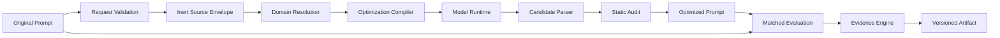

# Architecture

## 1. Design Principles

1. Optimization is the product; governance supports it.
2. Prompt text and machine contracts are separate artifacts.
3. Model judgment is never treated as deterministic validation.
4. Every quality claim has an evidence ceiling.
5. Domain behavior is data-driven and testable.
6. A small coherent kernel is preferred over version-specific modules.

## 2. System Components

### Contract Layer

Owns versioned request, artifact, evaluation, and evidence schemas. It rejects
unknown fields by default and provides migration functions when schemas change.

### Domain Registry

Resolves explicit or inferred domains and returns a domain excellence profile.
Profiles are declarative records, not Python modules named after releases.

### Optimization Compiler

Transforms an optimization request into:

- an inert source envelope;
- a recovered behavioral-contract task;
- a selected optimization architecture;
- domain criteria;
- output and evidence rules.

The compiler itself is deterministic. The model generates candidate Prompts.

### Optimization Runtime

Calls a configured model adapter, generates multiple candidates when warranted,
selects or synthesizes a winner, and parses the optimized Prompt from one strict
JSON object containing only `optimized_prompt`. JSON escaping, rather than a
sentinel tag, makes arbitrary Prompt text representable without delimiter
collisions.

Adapters must expose provider, model, parameters, tool permissions, and token
usage. Credentials never enter artifacts.

### Static Audit Engine

Checks:

- empty or malformed input;
- injection and authority-override patterns;
- unsupported superiority claims;
- undefined template variables;
- conflicting output contracts;
- missing high-risk boundaries;
- excessive prompt size and repeated instructions.

Static audit findings are evidence, not proof of runtime quality. An E1 artifact
contains the hash-bound source Prompt; validation reruns both source and
optimized audits and derives E0/E1 from replay rather than trusting serialized
findings or a rehashed pass flag.

### Evaluation Engine

Runs original and optimized Prompts against versioned suites. It contains:

- executor adapters;
- deterministic checks;
- blind judge orchestration;
- score aggregation;
- regression gates;
- artifact hashing;
- replay metadata.

### Evidence Engine

Assigns the maximum claim allowed by available evidence.

| Level | Meaning |
|---|---|
| E0 | Static candidate only; no execution evidence |
| E1 | Deterministic structure, security, or contract checks passed |
| E2 | Matched execution on a limited representative suite |
| E3 | A source-reproduced aggregate of at least three compatible runs whose model calls are independently receipt-verified |
| E4 | E3 plus a source-reproduced, artifact-bound, full-overlap review with independently verified reviewer submissions |
| E5 | Independently reproducible, versioned, sustained evidence for a narrowly stated claim |

E5 is not universal superiority and is not award equivalence.

### Artifact Store

Stores immutable source, optimized Prompt, controls, profiles, outputs, judge
reports, hard-check results, hashes, and generated summaries. Local filesystem
is the first implementation; database and object-store adapters come later.

### Repeated Evaluation and Review

Single matched evaluations produce at most scoped E2 evidence. The replicate
aggregator validates at least three configuration-compatible runs and rejects
mock or unidentified calls, reused provider response IDs or trusted receipt
digests, duplicate semantic Prompt/output/judge fingerprints, and derived-field
tampering. Provider names, response IDs, usage, and local hashes remain
self-reported diagnostics; E3 requires an external `ModelCallReceiptVerifier`
to bind every call to the exact request, response, and evaluation context.
Timing or hash changes cannot disguise a copied run. Authority validation
reloads all source run directories with that verifier, recomputes each copied
`benchmark-definition.json`, and requires every source Prompt, case set, and
case hash to match it. Detached
report self-consistency is not E3 authority. A single evaluation cannot
self-promote through a caller flag. Human review binds every packet, key,
submission, evaluation, and counted case to that aggregate; E4 requires every
counted case to be covered by the same set of at least three unique reviewers
whose bound submissions carry unique receipts from an external
`ReviewerSubmissionVerifier`. The HMAC-v3 packet exposes only opaque review IDs,
rubrics, A/B outputs, a sample size, and a blinding-key commitment; the key
retains its fresh 256-bit blinding key, sampling seed, source identities,
optimized labels, and probe markers. Each packet binds the balanced-sampling
algorithm, blind A/B assignment, and at least two reversed position probes.
Per-reviewer probe completion/consistency, non-degenerate base selections, full
overlap, direct reviewer consensus, and positive direct human win/loss balance
are derived gates. Coordinator-only adjudications remain diagnostic and make a
report E4-ineligible. The authority validator reloads the human-review plan, reconstructs every
packet/key pair, and then reconstructs the report from every source artifact.
SHA-256 links provide integrity, not signatures or identity. Image review
remains a separate artifact-bound evidence path. Visual packets use
`balanced_hmac_sha256_v2`; each packet/key pair receives a fresh 256-bit secret,
the public protocol exposes only its commitment, and the private key retains the
secret, seed, source mapping, and optimized labels. R06 authority reloads a
strict `visual-review-plan`, replays the complete mapping, and exactly rebuilds
the report with unique receipts from an `ImageGenerationReceiptVerifier` and a
`VisualReviewerSubmissionVerifier`. Aggregation without those host-supplied
verifiers remains diagnostic.

### Software Verification Boundary

Software cases use case-owned AST extraction and hidden harnesses. Release-grade
execution requires the policy-verified Docker backend described in
`SOFTWARE-SANDBOX.md`. Production verifier code has no host-Python fallback;
missing or unverified Docker fails before candidate execution. R05 authority
also requires a strict `code-execution-plan` and an explicit live
`DockerSandbox`; validation reloads the bound evaluation, reruns all sandbox
probes and case checks, and requires exact report reproduction. Detached or
offline self-hashed code facts are not authoritative.

### Local Service and Readiness

The local service stores idempotent optimization jobs in SQLite and writes
artifacts atomically to the filesystem. The readiness layer consumes referenced
evidence artifacts and four authority-source groups: benchmark run directories,
the human-review plan, the code-execution plan, and the visual-review plan. It
replays source-aware validators with the required receipt verifiers and live
sandbox before evaluating the ten stable-release requirements. These
post-v0.3 capabilities remain gate-pending until the evidence and contract gaps
listed in `IMPLEMENTATION-STATUS.md` are closed.

### Interfaces

- Python API for integration;
- CLI for local use and CI;
- HTTP API after the kernel and evaluation system are stable;
- optional web UI after API acceptance tests exist.

## 3. End-to-End Data Flow


```mermaid
flowchart LR
    A["Original Prompt"] --> B["Request Validation"]
    B --> C["Inert Source Envelope"]
    C --> D["Domain Resolution"]
    D --> E["Optimization Compiler"]
    E --> F["Model Runtime"]
    F --> G["Candidate Parser"]
    G --> H["Static Audit"]
    H --> I["Optimized Prompt"]
    I --> J["Matched Evaluation"]
    A --> J
    J --> K["Evidence Engine"]
    K --> L["Versioned Artifact"]
```

## 4. Core Data Contracts

### Optimization Request

- schema version;
- source Prompt;
- optimization mode;
- output format;
- domain and audience controls;
- target model and surface;
- required behaviors and forbidden changes;
- candidate count for the bounded generation/selection strategy.

### Optimization Artifact

- artifact schema version;
- package version;
- source Prompt content;
- source hash;
- optimized Prompt;
- resolved domain;
- architecture;
- model-call and candidate-selection runtime metadata;
- source and optimized static-audit findings;
- evidence level, status, claim, and limitations;
- payload hash binding all artifact fields.

### Evaluation Record

- suite and case versions;
- model settings;
- original and optimized outputs;
- randomized label map;
- deterministic findings;
- judge scores;
- aggregate result;
- regression status;
- hashes.

## 5. Security Boundaries

- Source Prompt content is JSON-encoded before model use.
- Source content cannot set evidence level or override system instructions.
- Web, file, and tool results are untrusted inputs.
- Model outputs are parsed and validated before publication.
- Executable code evaluation uses case-specific restricted harnesses inside a
  digest-pinned, resource-limited Docker sandbox, or formal machine contracts.
- Active probes verify network denial, read-only root, writable temporary
  storage, non-root identity, timeout termination, and memory enforcement.
- Consequential external actions require explicit authorization.

## 6. Failure Behavior

- Invalid request: fail before model invocation.
- Unresolvable core ambiguity: ask no more than three questions.
- Model output cannot be parsed: bounded repair, then fail closed.
- Static fatal flaw: return candidate with blocked claim or regenerate.
- Evaluation regression: do not publish verified-improvement status.
- Missing evidence: remain at the highest proven evidence level.

## 7. Repository Shape

```text
prompt-performance-engine/
  prompts/
  profiles/
  schemas/
  src/prompt_performance_engine/
  tests/
  benchmark/
  scripts/
  artifacts/
  docs and release specifications
```

Version-specific behavior lives in migrations and changelogs, not hundreds of
release-named runtime modules.

## 8. Current Contract Boundaries

- Domain profiles are a hybrid of declarative metadata and executable Python
  guardrails/checkers; adding a domain is not currently data-only.
- Optimization artifacts provide self-consistency hashes, not signatures or
  protection against a local administrator replacing both data and hashes.
- The released `0.3.0` contract covers static audit and E0/E1 evidence. Later
  evaluation, service, review, sandbox, and readiness modules are implemented
  in the working tree but remain unreleased and gate-pending.
- The 2026-07-21 hardening closed the host-execution, E1/E3/E4-authority, R05/R06
  source-authority, HTTP request-Schema, and model-response transport gaps found
  in the review.
  Output-mode behavior, release identity, unsigned local evidence, and external
  readiness evidence remain separate release concerns; this work does not
  establish stable readiness.
